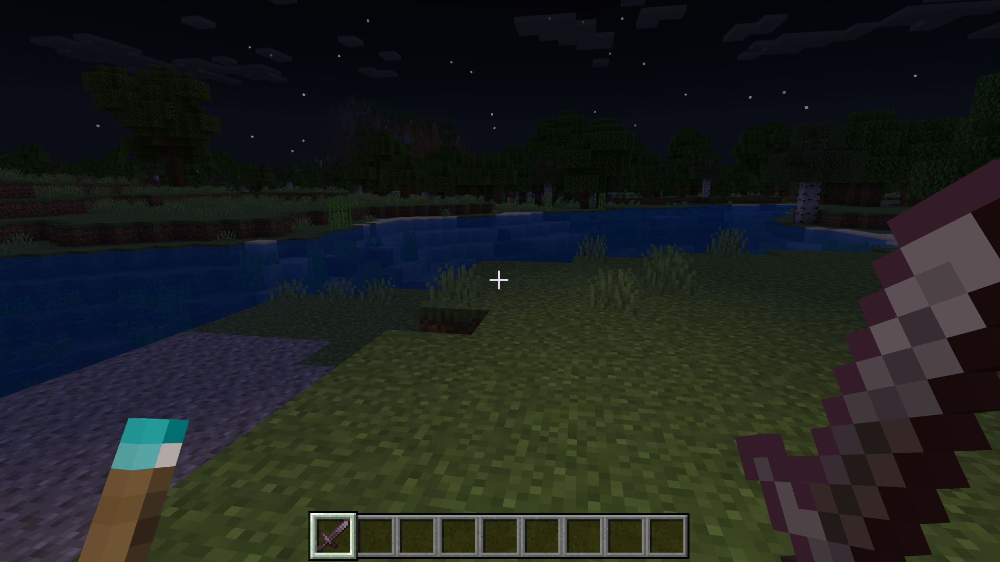

<h1> Dynamic Torchlighting Addon </h1>

This addon mod allows you to light up the area around you with a torch. The torch can also be equipped in your offhand slot, allowing you to light up the area while holding another item in your main hand.

## Credits

This addon was created by @keyyard.

## Features

- Dynamic lighting with torches.
- Torches can be equipped in the offhand slot.
- Realistic light radius and flickering effects.
- Compatible with other mods and resource packs.

## Screenshots

## How to use

1. Clone the repository.
2. Install NPM packages by running `npm install`.
3. Run `npm run local-deploy` to deploy the addon to your local Minecraft.
4. Open Minecraft and enable the addon in your world settings.
